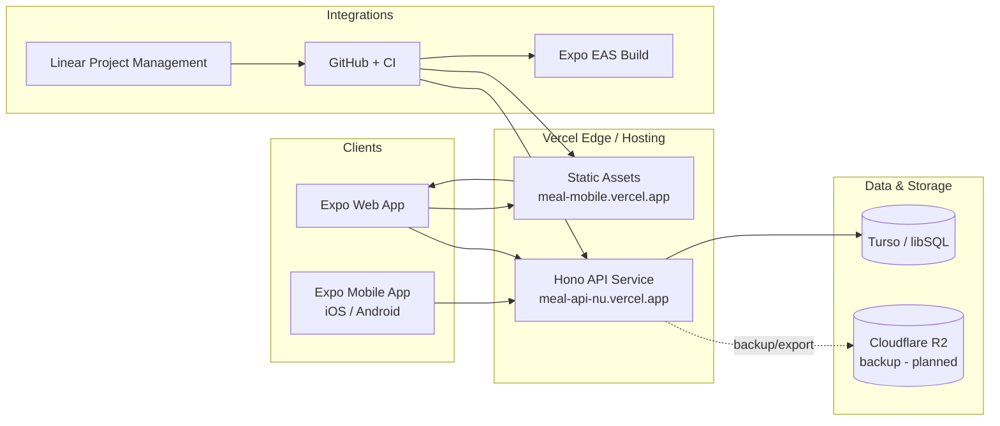
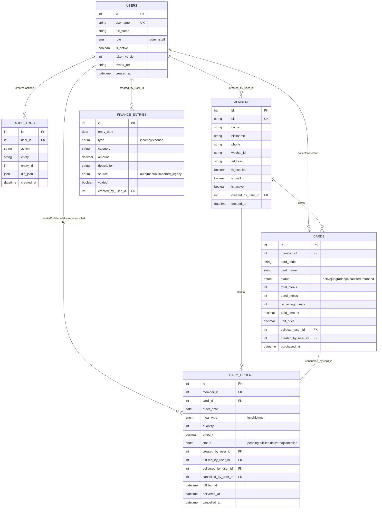

# Meal Membership System - Architecture Diagrams

This document contains high-level design diagrams in Mermaid format for:

- System Design
- Database Design
- API Design

---

## 1) System Design

---

## 2) Database Design

---

## 3) API Design

```mermaid
flowchart TB
  Client[Client App] --> Auth["/api/auth"]
  Client --> Members["/api/members"]
  Client --> Cards["/api/cards"]
  Client --> Orders["/api/orders"]
  Client --> Finance["/api/finance"]
  Client --> Users["/api/users"]
  Client --> Audit["/api/audit-logs"]

  subgraph AuthDomain["Authentication Domain"]
    Auth --> Login["POST /login"]
    Auth --> Me["GET /me"]
  end

  subgraph MemberDomain["Member Domain"]
    Members --> MemberList["GET /"]
    Members --> MemberCreate["POST /"]
    Members --> MemberUpdate["PATCH /:id"]
    Members --> MemberArchive["PATCH /:id/archive"]
    Members --> MemberDelete["DELETE /:id"]
  end

  subgraph CardDomain["Card Domain"]
    Cards --> CardList["GET /?member_id=..."]
    Cards --> CardPurchase["POST /"]
    Cards --> CardUpgrade["POST /:id/upgrade"]
    Cards --> CardRenew["POST /:id/renew"]
    Cards --> CardRefund["POST /:id/refund"]
    Cards --> CardPatch["PATCH /:id"]
  end

  subgraph OrderDomain["Order Domain"]
    Orders --> OrderList["GET /"]
    Orders --> OrderToday["GET /today"]
    Orders --> OrderCreate["POST /"]
    Orders --> OrderPatch["PATCH /:id"]
    Orders --> OrderStatus["PATCH /:id/status"]
    Orders --> OrderDeliveryFailed["PATCH /:id/delivery-failed"]
    Orders --> OrderCancel["PATCH /:id/cancel"]
  end

  subgraph FinanceDomain["Finance Domain"]
    Finance --> FinanceList["GET /"]
    Finance --> FinanceExpense["POST /expense"]
    Finance --> FinancePatch["PATCH /:id"]
    Finance --> FinanceDelete["DELETE /:id"]
  end

  subgraph AdminDomain["Admin / Ops Domain"]
    Users --> UserList["GET /"]
    Users --> UserAccess["PATCH /:id/access"]
    Users --> UserResetPw["PATCH /:id/password"]
    Users --> UserAvatar["PATCH|DELETE /me/avatar"]
    Audit --> AuditList["GET /api/audit-logs"]
  end
```

Notes:

- `PATCH /api/orders/:id/delivery-failed` is a business alias of cancellation for `fulfilled` orders, with mandatory reason and meal rollback side effects.

