# 订餐会员管理系统 — 业务流程图

本文档用 mermaid 梳理系统的关键业务流程，便于员工培训、bug 追溯和新功能对齐。每张图下方附简短说明。实施时所有代码路径必须与本图一致；若代码和流程不一致，以代码为准时请同步更新本文档。

## 实现状态一览（2026-04-24）

| 章节 | 业务能力 | 状态 |
| --- | --- | --- |
| 2 | 登录 / JWT / 限流 | 已上线 |
| 3 | 会员 CRUD + 搜索 + 归档 | 已上线 |
| 4 | 购卡 / 升级 / 换卡（院内外价目） | 已上线 |
| 5 | 每日订餐录入（午 + 晚拆条 + 扣卡 + 散餐 + Idempotency） | 已上线 |
| 6 | 出餐 / 送餐（pending → fulfilled → delivered，含 cancel 冲销 + delivery-failed） | 已上线（并入订餐页 Tab，无独立 packing 路由） |
| 7 | 取消订单原子冲销 + 终态锁定 | 已上线 |
| 8 | 财务（自动入账 + 手动支出 + 筛选 + 汇总） | 已上线 |
| 0.6 | 次日接龙汇总（D−1 22:05 Cron + 长图/PDF） | 未上线（MEA-18） |
| 9 | R2 备份 / 恢复 | 未上线（MEA-22） |
| 10 | 移动端 Summary（日/周/月/年 + 基准线） | 未上线（MEA-20） |
| — | 今日收工报表 | 未上线（MEA-19） |
| — | 多类型 Excel 导出 | 未上线（MEA-21） |
| — | 退卡 | 未上线（仅 UI 占位，后端无路由） |
| — | 散客 / 无会员录单 | 未上线（`POST /api/orders` 仍要求 `member_id > 0`） |

未上线的章节在下文保留原流程图作为**设计目标**；员工培训时请以「已上线」章节为准，未上线章节会在 Phase 4+ 依次交付。

## 目录

0. [App 使用流程 — 用户旅程](#0-app-使用流程--用户旅程)
1. [系统全貌](#1-系统全貌)
2. [用户登录与权限](#2-用户登录与权限)
3. [会员注册与维护](#3-会员注册与维护)
4. [购卡 / 升级 / 换卡](#4-购卡--升级--换卡)
5. [每日订餐（录入阶段）](#5-每日订餐录入阶段)
6. [出餐 / 打包工作流（手机专用）](#6-出餐--打包工作流手机专用)
7. [取消订单（原子冲销）](#7-取消订单原子冲销)
8. [财务记账](#8-财务记账)
9. [数据备份 / 恢复](#9-数据备份--恢复)
10. [移动端 Summary 汇总](#10-移动端-summary-汇总)
11. [状态与字段速查](#11-状态与字段速查)

---

## 0. App 使用流程 — 用户旅程

这一章从"用的人"的视角串一下典型的一天 / 一条会员生命周期 / 一笔订单全生命周期。开发时把这些当验收剧本即可。

### 0.1 入口与端差异（手机 vs 电脑）

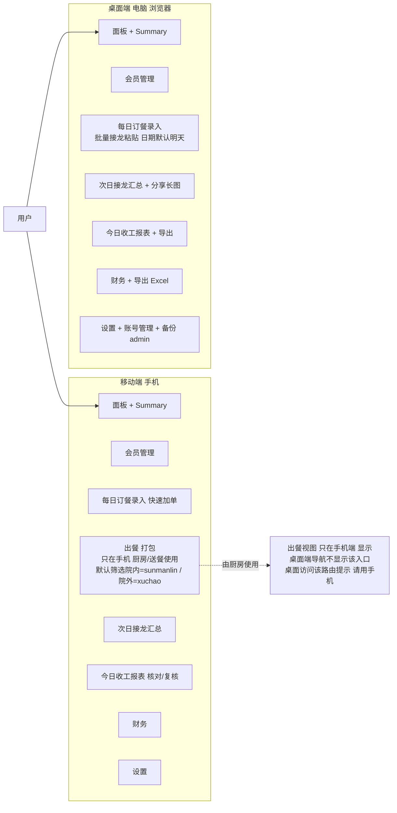

**端定位**：
- **手机**：外出 / 厨房 / 快速录入 / 出餐打包 / 看 Summary
- **电脑**：日常数据录入（接龙批量粘贴）、审核、导出 Excel、账号 / 备份 / 员工管理
- **出餐打包视图仅在手机端可见**，桌面端不做；桌面访问 `/packing` 跳转到提示页。

### 0.2 Staff 两天的工作流（接龙 → 出餐 → 送达 → 收工 → 下一轮接龙）

现实节奏（摘自运营沟通，版本 V2）：

> 1. 每天早 / 中 / 晚三次在微信群发起**次日**接龙，**22:00 截止**
> 2. 接龙结束后，**孙梦瑶** 汇总 → 同步给 **孙漫林**（业务负责人）
> 3. 次日按接龙人数采购食材
> 4. **孙漫林 + 徐超** 负责后厨和送餐；**徐超送院外**、**孙漫林送院内**
> 5. 中午送完午餐后，**下午孙漫林做晚餐并送餐**
> 6. 晚上 **孙梦瑶** 统计采购支出 / 包卡收入 / 午晚用餐人数 → 发 **高平** → 高平录入

系统侧对应的端到端角色分工：

| 角色 | 系统账号 | 职责 | 系统里做的事 |
| --- | --- | --- | --- |
| 业务负责人 | `sunmanlin`（staff） | 后厨 + 送院内 + 做晚餐 | 看接龙汇总、出餐/送达院内订单、看今日收工报表 |
| 接龙 + 收款 + 采购 | `sunmengyao`（staff） | 收接龙 + 22:00 统计 + 晚间核算 | 录入次日订单、查接龙汇总、录采购支出、收款人默认 |
| 数据录入员 | `gaoping`（staff） | 数据录入 + 日常核对 + 补录 | `default_recorder_user_id` 默认指向他；打开"今日收工报表"对数即可，无需签字 |
| 后厨 + 院外送餐 | `xuchao`（staff） | 后厨 + 送院外 | 打开出餐视图 默认筛选 "院外" ，标已出餐 / 已送达 |
| 远程管理员 | `rNLKJA`（超级管理员） | 系统维护 + 备份 + 账号管理 | 面板 + 删除 + 员工管理 + 备份触发；不受数据录入白名单限制 |

**写操作管控**：生产可将 `DATA_OPERATOR_ENFORCEMENT=1`，此时仅 **超级管理员** 与 App「权限管理」中勾选 **允许写操作** 的账号可改会员/卡/订单/财务；**一般管理员也可设为只读**，避免误触。详见仓库根目录 [README.md](../README.md) 的「权限、角色与数据写操作管控」。

以下 sequence 画的是 **D−1 晚 到 D 晚** 的完整流程，`D` 指用餐当天。

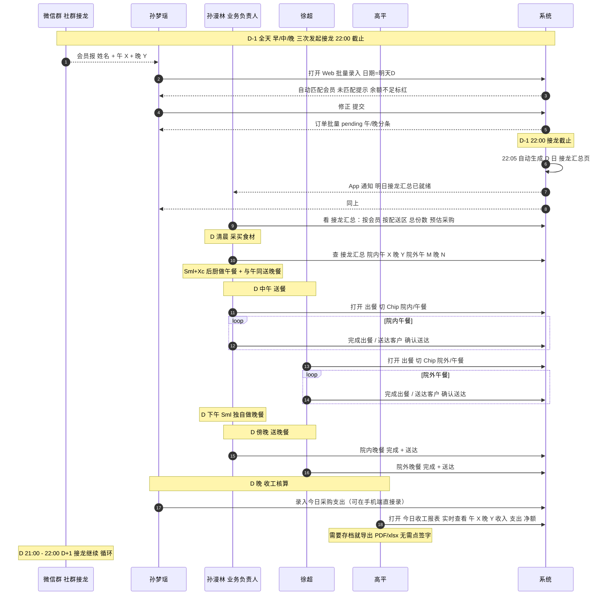

**优化点（与口头流程的差异）**：

- 原"孙梦瑶统计 → 微信发给孙漫林"→ **系统自动生成"接龙汇总"页**，所有人直接在 App 看，不用再走微信
- 原"孙梦瑶统计晚上数据 → 微信发给高平 → 高平录入"→ 数据本身已由每次录入实时写入；"今日收工报表"是**实时视图**，谁打开谁看最新；孙梦瑶只负责录采购支出，高平不必再手工录入任何汇总，想留档就直接导出 PDF / xlsx；**不再需要双人签字也不需要微信转述**
- 徐超和孙漫林**分别用各自账号操作**，打餐视图按"院内 / 院外"自动分组；谁送的谁标送达，审计可追溯

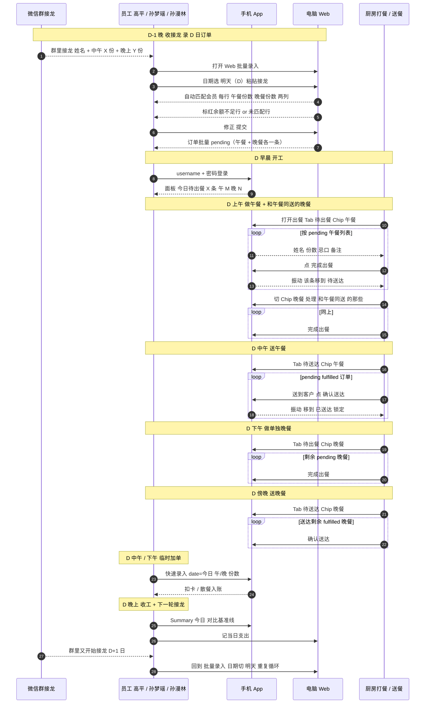

**关键规则**：
- 录入时间 ≠ 用餐日期。**`order_date` 永远是"哪一天吃"**（通常 = 录入日的次日）
- 批量录入 Modal 的日期默认**明天**（因为最常见场景是前一晚接龙）；提供快捷按钮 `今天 / 明天 / 自定义`
- 快速录入（单条、临时加单）Modal 的日期默认**今天**（因为临时加单多数当天生效）

### 0.3 Admin 周期性任务

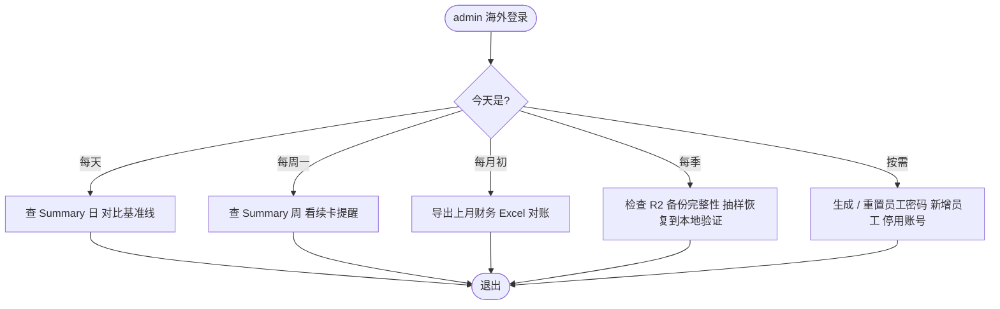

### 0.4 会员生命周期

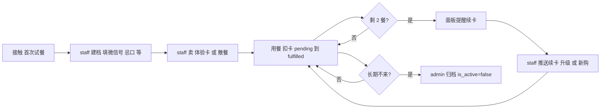

### 0.5 订单一生

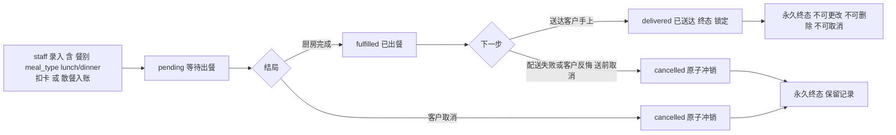

**同一会员同一天 一中一晚 = 两条独立订单**，各自走独立的状态机。打餐时按餐别分批。

### 0.6 接龙汇总（D−1 22:05 自动生成）

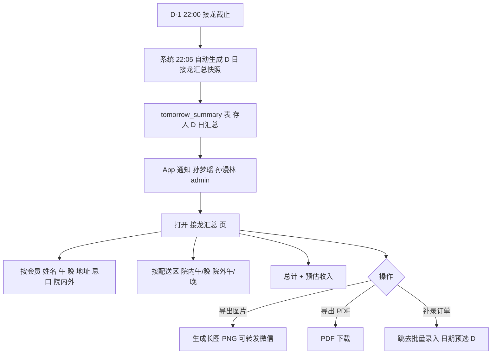

**补录规则**：22:00 之后还要录 D 日订单时（漏接龙等情况），批量录入页会弹琥珀色 Banner：

> 已过当日接龙截止时间（22:00），此次补录将刷新已生成的接龙汇总。确认继续？

用户点"继续"后正常录入；系统在下一次查看接龙汇总时自动重算快照（不走 cron 等到次日 22:05）。

### 0.7 今日收工报表（实时视图，无签字流程）

**设计原则**：数据本身已经通过每次"录入 / 完成 / 送达 / 取消 / 支出"写入数据库；报表不必生成、不必签字、不必归档。它就是一个随时能打开查看的当日聚合视图。谁都可以看，谁都可以导出。

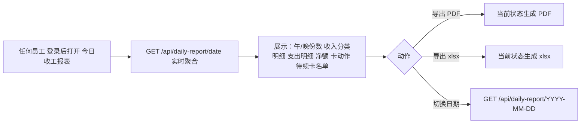

**关键点**：

- 无 `daily_reports` 表、无 cron、无 reviewer / archive 字段 —— 避免把工作流硬编码到数据结构里
- 数据事后被修改（如取消某笔订单），下次打开报表自然看到新数值
- 需"定格某天数据"时直接导出 PDF / xlsx（文件本身就是不可变快照）
- 追溯改动时查 `AuditLog`

### 0.8 首次上手流程（新员工）

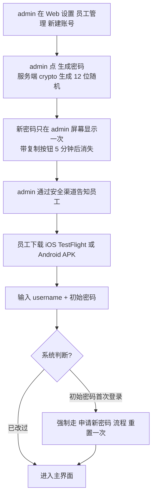

---

---

## 1. 系统全貌

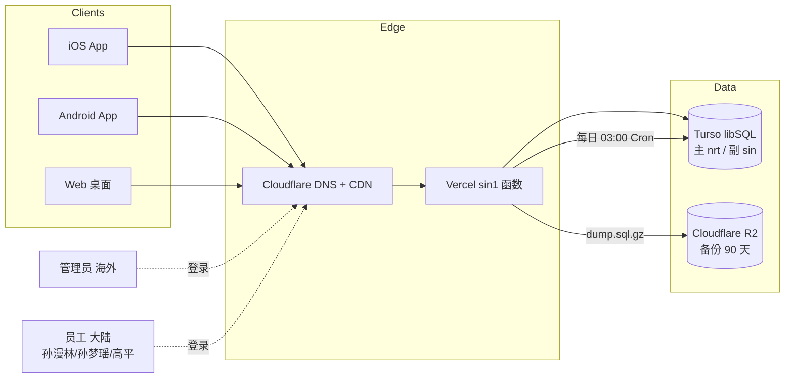

## 2. 用户登录与权限

### 2.1 登录流程

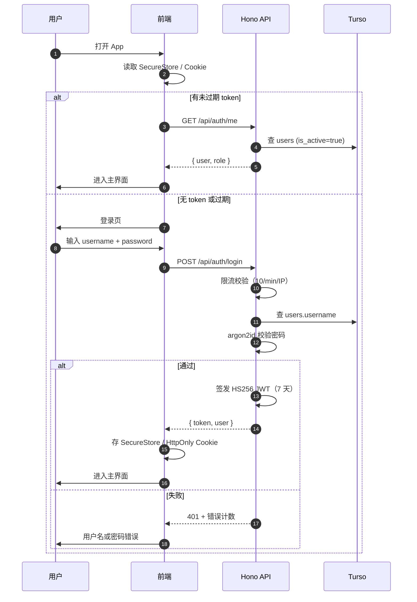

### 2.2 权限分支

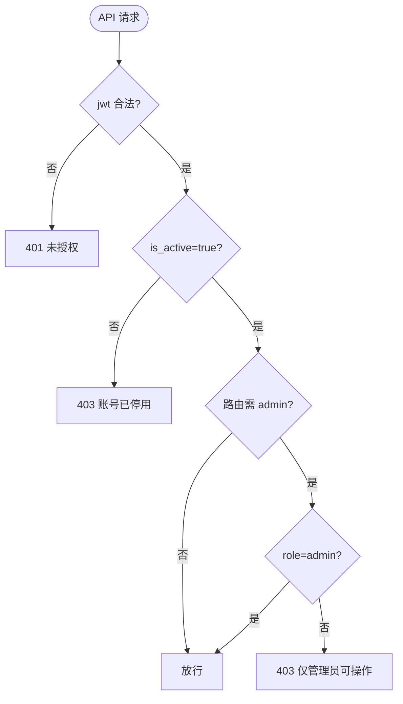

**记忆口诀**：staff 可 CRUD 业务数据中的 **CRU**（创建 / 读取 / 更新），**不可 D**（删除）；admin 全权。

## 3. 会员注册与维护

### 3.1 新建会员

```mermaid
flowchart TD
    start([员工在 App 点 新增会员]) --> form[填写姓名 / 昵称 / 手机 / 微信号 / 地址 / 医院订阅 / 忌口]
    form --> submit[提交]
    submit --> dupe{手机号已存在?}
    dupe -- 是 --> warn[提示重复，跳转该会员 或 强制继续]
    dupe -- 否 --> uid[系统按规则拼 UID\n昵称或姓名(手机号)]
    uid --> save[写 Member\ncreated_by_user_id=当前登录\ncreated_at=now]
    save --> audit[写 AuditLog create member]
    audit --> done([回到会员列表])
```

### 3.2 会员字段分层

```mermaid
flowchart LR
    subgraph 身份识别
        uid[UID 自动生成\n昵称或姓名(手机号)]
        name[姓名]
        nickname[昵称]
    end
    subgraph 联系方式
        phone[手机号 11 位]
        wechat[微信号]
        addr[地址]
    end
    subgraph 业务属性
        hosp[医院订阅 checkbox]
        diet[永久忌口\n每次订餐自动带出]
    end
    subgraph 审计
        createdBy[创建人]
        createdAt[创建时间]
        updatedAt[最后修改时间]
    end
```

## 4. 购卡 / 升级 / 换卡

### 4.1 卡状态机

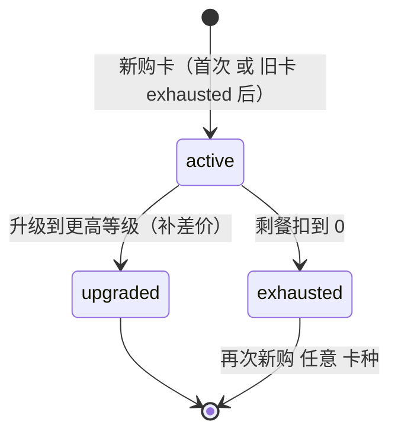

**重要：卡永不过期（No-Expiry 约定）**

- 系统**不存在** `expired_at` 字段、**不存在**过期定时任务、**不存在**失效校验
- `active` 卡只会因为"被升级"或"剩餐扣到 0"才变状态；时间流逝本身不触发任何状态变化
- 客户哪怕隔了一年再回来，旧卡剩的餐数仍然有效，可以直接扣
- 续卡本质是"新购新卡"，不是"延长旧卡到期日"

### 4.2 三条路径的决策树

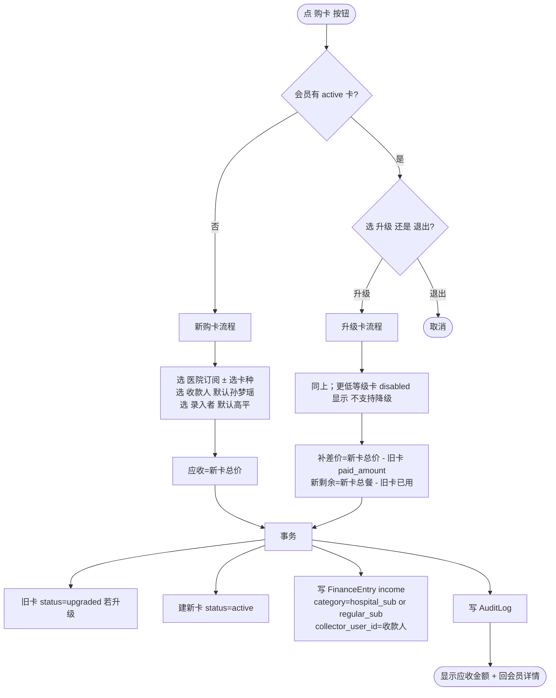

### 4.3 升级禁降级的校验

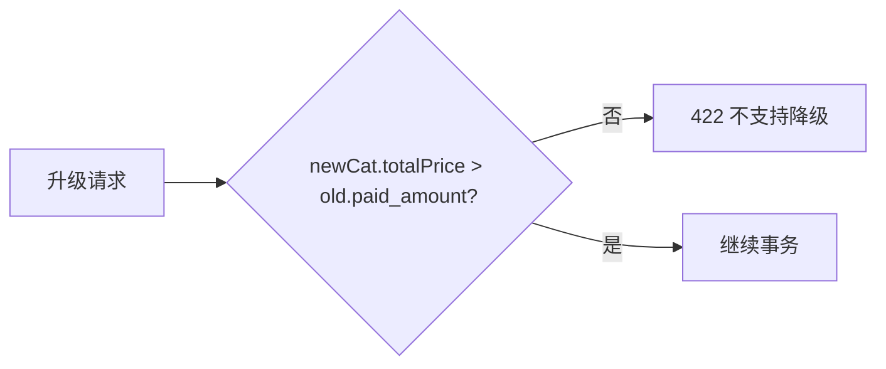

## 5. 每日订餐（录入阶段）

### 5.1 录入决策

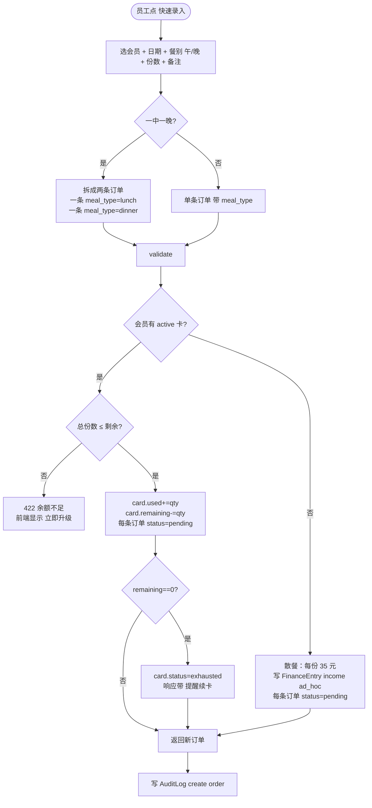

**关键点**：同一会员同一天的午餐和晚餐是**两条独立订单**，但录入 UI 是"一步式"——员工在一次 Modal 里分别填 `午餐份数 / 晚餐份数`，提交时服务端原子创建 N 条订单，任一失败全部回滚。

### 5.2 批量录入

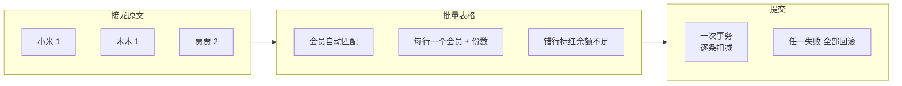

## 6. 出餐 / 打包工作流（手机专用）

> **此模块仅在手机端提供**。桌面端不显示导航入口；直接访问路由会提示"出餐视图为手机专用"。电脑的定位是数据录入 / 管理 / 导出，不参与出餐。
>
> **订单有 4 个业务状态 + 2 个终态**：`pending`（等待出餐）→ `fulfilled`（已出餐，等送达）→ `delivered`（**已送达，永久锁定**）；任一中间状态可以 → `cancelled`（已取消）；`delivered` 与 `cancelled` 都是**不可更改、不可删除**的终态。
>
> **每条订单必须标注 `meal_type`：`lunch`（午餐） 或 `dinner`（晚餐）**。同一会员一天要"中餐 1 份 + 晚餐 1 份"会**拆成 2 条订单**，各自独立走状态机，独立扣餐（订阅卡扣 2 餐，散餐记 2×35）。
>
> 对 `fulfilled` 订单，新增“送餐失败”业务动作：前端要求选择失败原因，后端按取消冲销处理，并把 `cancel_reason` 写成 `配送失败：...`，以便后续客服解释与数据复盘。

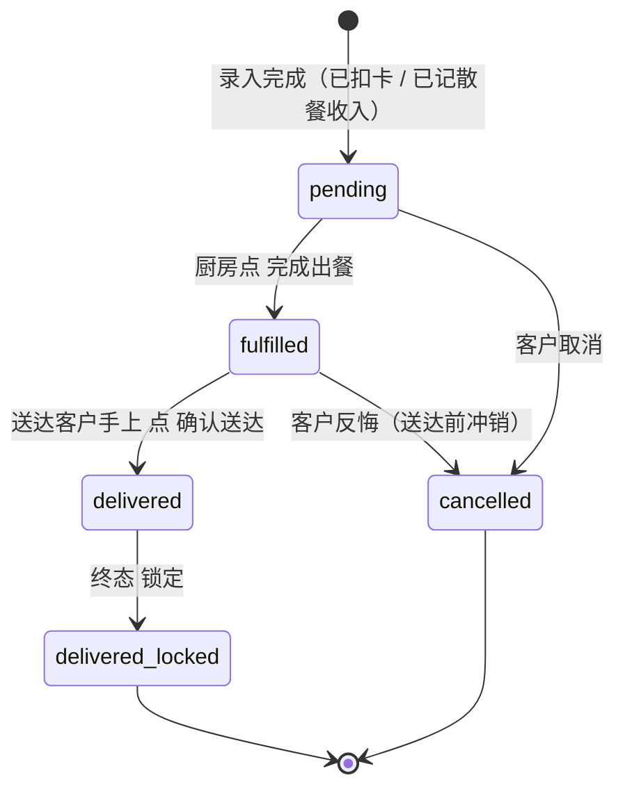

**锁定规则**：`delivered` 与 `cancelled` 都进入终态。
- `delivered` 不可被编辑、删除、取消（任何角色、任何接口都不行；需要数据级恢复时由 admin 直接操作 Turso CLI，并写单独的 recovery AuditLog）
- `cancelled` 不可再改；要恢复只能新建订单

### 6.1 打包视图交互（4 个 Tab）

```mermaid
flowchart TD
    open([打开 出餐 页面]) --> fetch[GET /api/orders/queue]
    fetch --> list[Tab: 待出餐 / 待送达 / 已送达 / 已取消]
    list --> tap[点一张订单卡片]
    tap --> detail[确认页：姓名 份数 忌口 订单备注 地址 电话]
    detail --> action{当前状态}
    action -- pending --> a1{选择}
    a1 -- 完成出餐 --> fulfill[PATCH /api/orders/id/fulfill\nstatus=fulfilled\nfulfilled_at=now\nfulfilled_by=当前登录]
    a1 -- 取消 --> cancelFlow[跳到 7 取消流程]
    action -- fulfilled --> a2{选择}
    a2 -- 确认送达 --> deliver[PATCH /api/orders/id/status\nstatus=delivered\ndelivered_at=now\ndelivered_by=当前登录\n订单从此锁定]
    a2 -- 送餐失败 --> failFlow[PATCH /api/orders/id/delivery-failed\nreason=快速原因或补充文本\n自动退餐并写失败原因]
    a2 -- 取消 --> cancelFlow
    action -- delivered --> readonly[只读展示 不可操作]
    action -- cancelled --> readonly
    fulfill --> feedback[Haptic 振动 + 该条从 待出餐 移到 待送达]
    deliver --> feedback2[Haptic 振动 + 该条从 待送达 移到 已送达 并上锁标记]
    feedback --> list
    feedback2 --> list
    failFlow --> list
```

### 6.2 4 个 Tab 的语义

| Tab | 含状态 | 可做动作 |
| --- | --- | --- |
| 待出餐 | `pending` | 完成出餐 / 取消 |
| 待送达 | `fulfilled` | 确认送达 / 送餐失败退餐 / 取消 |
| 已送达 | `delivered` | 只读（带锁图标，提示"已送达 锁定"） |
| 已取消 | `cancelled` | 只读（灰色 + 原因） |

交互约束补充（2026-04-28）：

- 在订单状态面板中，当订单为 `fulfilled` 时，“取消”入口直接替换为“送餐失败并退餐”。
- 失败动作必须先选原因再提交，提交后统一走 `delivery-failed` 路由并触发退餐冲销。
- 送餐失败相关入口统一危险色（红）显示，避免一线操作员误触。

### 6.3 午餐 / 晚餐分批

现实的打餐节奏（摘自运营沟通）：

- **上午做**：当日所有 `meal_type=lunch` 订单 + 当日 `meal_type=dinner` 但客户选择"和午餐一起送"的订单
- **下午做**：单独订晚餐、需要下午另送的订单

系统侧做**两件事**：

1. **给订单加 `meal_type` 字段（lunch / dinner，必填）**。同一会员一天"一中一晚"= 2 条独立订单
2. **打餐视图默认按午餐优先排序**，并顶部提供 `午餐 / 晚餐 / 全部` 筛选

> 关于"晚餐是否和午餐一起送"目前不在系统里硬编码；沿用现有做法——员工根据经验判断，批量做在午前，个别晚餐拖到下午再做。若后续希望系统提示，可在会员资料里加一个 `prefers_delivery_with_lunch` 的偏好位（**现在先不加**，避免过度设计）。

### 6.4 打餐视图的 2 层筛选

```mermaid
flowchart TD
    open([打开 出餐]) --> tabs[Tab 按状态: 待出餐 / 待送达 / 已送达 / 已取消]
    tabs --> chips[筛选 Chip 按餐别: 午餐 默认 / 晚餐 / 全部]
    chips --> sort[排序: 午餐优先 再按 order_date 再按录入顺序]
    sort --> list[列表卡片 附带 午/晚 Badge]
    list --> count[Tab 数字 和 Chip 数字 实时更新]
```

**示例**（上午 10:30 点开"待出餐"）：

- 默认筛选 = 午餐 → 列出今天全部 `pending + meal_type=lunch` 共 18 条，按创建顺序排
- 切到"晚餐" → 列出今天全部 `pending + meal_type=dinner` 共 6 条
- 切到"全部" → 24 条混排，但视觉上午餐在前、晚餐在后

## 7. 取消订单（原子冲销）

这是最容易出错的路径，必须**一个事务**完成所有副作用。

```mermaid
flowchart TD
    start([点 取消]) --> confirm[二次确认 填原因]
    confirm --> tx[开启事务]
    tx --> status{原订单状态?}
    status -- pending --> reverse[冲销扣减]
    status -- fulfilled --> reverse
    status -- cancelled --> r409a[409 已取消不能再取消]
    status -- delivered --> r409b[409 已送达 终态锁定 不可取消]
    reverse --> kind{扣的是 订阅 还是 散餐?}
    kind -- 订阅 --> restoreCard[card.used-=qty\ncard.remaining+=qty]
    restoreCard --> statusCheck{card 原本 exhausted\n且 现在 remaining>0\n且 未被新卡替代?}
    statusCheck -- 是 --> reactivate[card.status=active]
    statusCheck -- 否 --> skip[保持原状态]
    reactivate --> mark
    skip --> mark
    kind -- 散餐 --> voidFinance[FinanceEntry.voided=true\n记录反向抵消 不删除]
    voidFinance --> mark
    mark[order.status=cancelled\ncancelled_at=now\ncancelled_by=当前登录\ncancel_reason=填的原因]
    mark --> audit[写 AuditLog action=cancel\ndiff_json=扣减与状态变化]
    audit --> commit[提交事务]
    commit --> done([返回新订单状态])
```

**关键不变量**：任何时刻，对于同一张卡，`cards.used_meals == SUM(daily_orders.quantity WHERE card_id=X AND status IN ('pending','fulfilled'))`。取消冲销完成后，不变量必须成立。

## 8. 财务记账

### 8.1 收入三分类的自动入账

```mermaid
flowchart LR
    subgraph 触发点
        buy[购新卡]
        upg[升级补差]
        adhoc[散餐订餐]
    end
    subgraph 分类
        hospSub[hospital_sub\n院内订阅]
        regSub[regular_sub\n院外订阅]
        adhocCat[ad_hoc\n散餐]
    end
    subgraph 入账
        entry[FinanceEntry\ntype=income\nsource=auto\ncollector_user_id=收款人]
    end
    buy --> hospSub & regSub --> entry
    upg --> hospSub & regSub --> entry
    adhoc --> adhocCat --> entry
```

### 8.2 支出手动录入

```mermaid
flowchart TD
    start([员工点 新增支出]) --> form[日期 金额 备注]
    form --> save[FinanceEntry\ntype=expense\ncategory=manual_expense\nsource=manual\ncreated_by_user_id=当前登录]
    save --> audit[写 AuditLog]
    audit --> list[回财务列表]
```

### 8.3 编辑 / 取消对财务的联动

```mermaid
flowchart LR
    edit[编辑订单 散餐 改份数] --> delta[diff 金额]
    delta --> updateFin[对应 FinanceEntry.amount 同步]
    cancel[取消散餐] --> voidFin[FinanceEntry.voided=true 反向抵消]
    refund[admin 改购卡 paid_amount] --> comp[写一条 FinanceEntry 补差或冲销]
```

## 9. 数据备份 / 恢复

### 9.1 自动每日备份

```mermaid
sequenceDiagram
    autonumber
    participant Cron as Vercel Cron 03:00 CST
    participant API as /api/cron/backup
    participant Turso
    participant R2
    Cron->>API: GET (Bearer CRON_SECRET)
    API->>Turso: libSQL .dump()
    API->>API: gzip
    API->>R2: PutObject daily/YYYYMMDD.sql.gz
    API->>Turso: 写 backup_logs 记录
    API-->>Cron: 200 { size, key }
```

### 9.2 手动备份 + 下载

```mermaid
flowchart TD
    admin([admin 打开 设置 备份]) --> list[GET /api/backup/list]
    list --> show[展示 日期 大小 下载链接]
    show --> action{动作}
    action -- 立即备份 --> manual[POST /api/backup/now\nkey=manual/YYYYMMDDHHmmss.sql.gz]
    action -- 下载 --> signed[API 签发 15 分钟 Signed URL]
    action -- 回列表 --> show
    manual --> list
    signed --> download[浏览器下载 .sql.gz]
```

### 9.3 灾难恢复（CLI，手动）

```mermaid
flowchart LR
    trigger[数据损坏] --> cli[运行 scripts/restore.ts]
    cli --> pick[选 R2 中的某个 备份文件]
    pick --> download[本地下载 + gunzip]
    download --> confirm[人工确认 YES/abort]
    confirm --> restore[turso db shell DB < dump.sql]
    restore --> verify[手工验证关键数据]
```

## 10. 移动端 Summary 汇总

### 10.1 维度切换

```mermaid
flowchart TD
    home[Summary 页面] --> pick[顶部 Tab：日 / 周 / 月 / 年]
    pick --> range[选时间：今日 / 本周 / 本月 / 本年\n或自定义区间]
    range --> fetch[GET /api/dashboard/summary?period=week&from=...&to=...]
    fetch --> kpi[指标卡片：用餐份数 / 收入 / 支出 / 净额 / 新增会员 / 购卡数 / 取消数]
    kpi --> chart[柱状图 + 两条参考线]
    chart --> base[基准线 = 近 8 个工作周的日均 / 周均]
    chart --> avgline[平均线 = 当前区间样本均值]
    chart --> medianline[中位数线 = 当前区间样本中位数]
```

### 10.2 "工作周"定义

```mermaid
flowchart LR
    n1[周一 到 周五] --> incl[计入 工作周 基准]
    n2[周六 周日] --> excl[计入 周末 对比]
    holiday[法定节假日] --> excl
```

说明：
- **基准线**：拿最近 8 个工作周（忽略节假日）的日均用餐量，画一条水平参考线
- **平均线**：当前视图区间内样本均值
- **中位数线**：当前视图区间内样本中位数，抵抗个别极端值

### 10.3 核心指标一览（每个周期都算）

| 指标 | 口径 |
| --- | --- |
| 用餐份数 | `SUM(daily_orders.quantity)`，状态排除 `cancelled` |
| 取消份数 | `SUM(daily_orders.quantity)` where `status=cancelled` |
| 收入 | `SUM(finance_entries.amount)` type=income, `voided=false` |
| 支出 | `SUM(finance_entries.amount)` type=expense |
| 净额 | 收入 − 支出 |
| 新增会员 | `COUNT(members)` where `created_at` 在区间内 |
| 新购卡数 | `COUNT(cards)` where `purchased_at` 在区间内 且 非升级产生 |
| 升级数 | `COUNT(cards)` where `upgraded_from_id IS NOT NULL` |

## 11. 状态与字段速查

### 卡状态

| 状态 | 含义 | 何时进入 | 何时离开 |
| --- | --- | --- | --- |
| `active` | 进行中，可扣餐 | 新购 / 升级创建 / 取消订单后剩余 > 0 复活 | 升级后标 upgraded / 扣到 0 变 exhausted |
| `upgraded` | 已升级，只读 | 被升级覆盖 | 永久（只读） |
| `exhausted` | 已用完，只读 | 剩余扣到 0 | 取消订单冲销后若 >0 且未被替代，可回 active |

### 订单状态

| 状态 | 中文 | 已扣餐? | 已记散餐收入? | 可编辑字段? | 可取消? | 可删除? |
| --- | --- | --- | --- | --- | --- | --- |
| `pending` | 等待出餐 | 是 | 是（若散餐） | 全部 | 是 | 仅 admin |
| `fulfilled` | 已出餐（等送达） | 是 | 是 | 备注 / 录入者（改份数 / 日期 / 餐别要二次确认） | 是（冲销） | 仅 admin |
| `delivered` | 已送达 | 是 | 是 | **不可编辑（终态锁定）** | **否** | **否（任何角色）** |
| `cancelled` | 已取消 | 否（已冲销） | 否（voided） | 不可编辑 | 已是终态 | 仅 admin（审计目的一般不删） |

补充：当取消来自配送失败时，`cancel_reason` 统一带前缀 `配送失败：`（后接快速原因/补充说明）。

### 订单餐别

| `meal_type` | 中文 | 常规制作时段 | 打餐视图默认 |
| --- | --- | --- | --- |
| `lunch` | 午餐 | 上午 | **默认筛选** |
| `dinner` | 晚餐 | 和午餐一起做的上午；单独晚餐下午 | 切换显示 |

### 角色

| 角色 | 登录名示例 | 业务职责 | 可做 |
| --- | --- | --- | --- |
| admin | `rNLKJA` | 老板 / 远程管理 | 全部 + 删除 + 备份 + 用户管理 |
| staff | `sunmengyao` | 默认收款人 | 录入 / 编辑 / 完成出餐 / 取消订单 |
| staff | `gaoping` | 默认录入人 | 同上 |
| staff | `sunmanlin` | 后备 | 同上 |

---

本文档随业务流程调整同步更新；若发现流程图与实际代码不一致，以 PR 修正。
