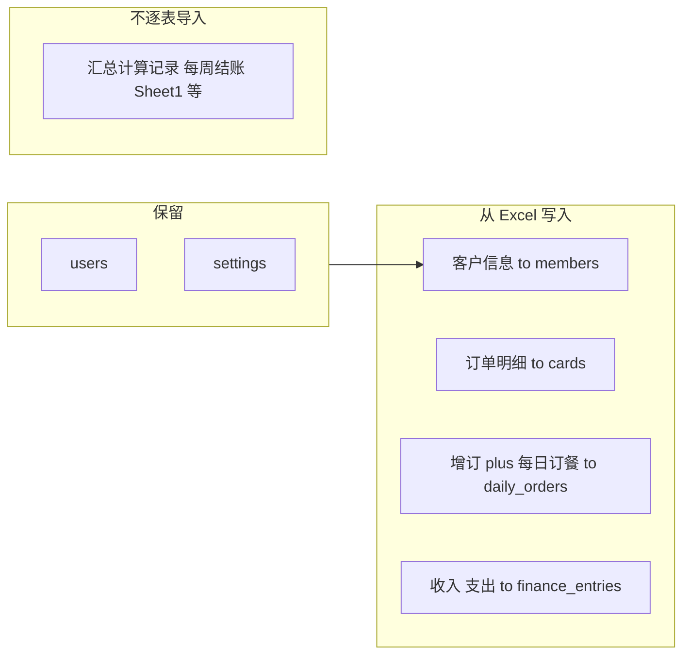

# V5 xlsm 导入运行计划（Runbook）

## 1. 数据源与工具

| 项目 | 说明 |
|------|------|
| 源文件 | [市医院健康漂亮餐订餐表-数据格式调整V5.xlsm](./市医院健康漂亮餐订餐表-数据格式调整V5.xlsm)（只读单元格，不执行宏） |
| 脚本 | [scripts/src/xlsm-import.ts](../scripts/src/xlsm-import.ts) |
| 默认命令 | 自仓库根目录执行 `pnpm` |

## 2. 前置条件

1. **环境变量**：仓库根目录 `.env`（或 `scripts/.env`）已配置 `TURSO_DATABASE_URL`；若使用 Turso 远程库，还需 `TURSO_AUTH_TOKEN`。
2. **库结构**：导入前须与代码 schema 一致。若曾报 `has no column named proof_set_id` 等错误，先执行：

   ```bash
   pnpm --filter @meal/api db:migrate
   ```

3. **账号**：库中至少有一条 `users` 记录；脚本优先使用 `role = admin` 的用户作为 `created_by_user_id`。若库为空，先执行种子脚本（如 `seed-accounts`）。

## 3. 导入范围（全量选项 A）

- **保留表**：`users`、`settings`
- **清空后重灌**：`finance_entries`、`daily_orders`、`cards`（先解除 `upgraded_from_id`）、`members`、存在的 `order_proof_sets`，以及 `audit_logs`、`notifications`、`export_logs`、`tomorrow_summaries`、`idempotency_keys`、`imported_order_summaries`、`imported_weekly_closings`、`imported_summary_snapshots`（与 `wipeBusinessData` 一致）。
- **`retail_products`**：`--wipe` **不会**删除该表。执行 wipe 后目录行仍保留；`finance_entries` 会先被清空，故不会出现指向已删流水的孤儿 FK，但若希望「与 Excel 全量重灌后目录一致」，需在 wipe/导入前后**手工维护** `retail_products`（例如先清空再按现价重建），以免 App 里仍显示旧商品名。



- **订餐汇总**：仅与脚本内聚合结果对账，差异写入 `needs_review.csv`，不当作数据源逐行入库。

## 4. 建议执行顺序

| 步骤 | 命令 | 目的 |
|------|------|------|
| A. 可选 | `pnpm --filter @meal/scripts xlsm-import -- --inspect` | 查看各 sheet 行数与样例行 |
| B. 推荐 | `pnpm --filter @meal/scripts xlsm-import` | Dry-run：统计 + 生成 `scripts/needs_review.csv`，**不写库** |
| C. 正式 | `pnpm --filter @meal/scripts xlsm-import -- --apply --wipe` | 清空业务表后按序写入（**不可逆**，请在目标库确认后再执行） |
| D. 自定义路径 | `pnpm --filter @meal/scripts xlsm-import -- --file=/绝对路径/文件.xlsm` | 覆盖默认 `doc/` 下 V5 文件名 |

**默认 xlsm 路径**（脚本内）：`doc/市医院健康漂亮餐订餐表-数据格式调整V5.xlsm`。

## 5. 成功验收

终端应出现类似输出：

```text
[done] members N, cards N, daily_orders N, finance N
```

若中途报错退出，检查 `needs_review.csv` 与终端栈信息；常见原因包括：**未迁移数据库**、Excel 缺列或 sheet 改名。

## 6. 导入后核对

1. 打开 **scripts/needs_review.csv**（相对仓库根为 `scripts/needs_review.csv`），处理 `duplicate_person_multi_cid`、`card_catalog_meals_mismatch`、`summary_*` 等类型。
2. 财务行使用 `legacy_income` / `legacy_expense`、`source = imported_legacy`；若报表与「标准收入类别」不一致，属预期内取舍，可在后续手工调整或改映射逻辑。

## 7. 风险摘要

- **`--wipe`**：除 `users`/`settings` 外业务数据会被删除后重建；生产库务必先确认连接串与备份策略。
- **非合并模式**：当前脚本不支持「不 wipe、只增量追加」；若需要合并导入，须另行设计。

## 8. 相关代码索引

- 列映射与业务说明：`xlsm-import.ts` 文件头部注释
- 院内卡目录：[packages/shared/src/card-catalog.ts](../packages/shared/src/card-catalog.ts)
- 数据库客户端：[apps/api/src/db/client.ts](../apps/api/src/db/client.ts)
- SQL 迁移目录：[apps/api/drizzle/](../apps/api/drizzle/)
